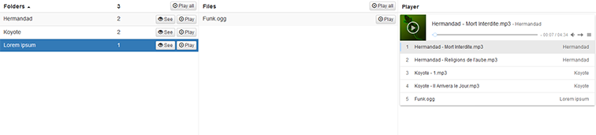

VueAudioPlayer
========================

Just a VueJs learning project, a responsive audio player.

[DEMO](http://vueaudioplayer.funkybits.fr)

Dependencies
--------------

- Symfony 3
- VueJs & Vuex 2
- Bootstrap 3 css
- APlayer

Build & run (dev)
--------------
1. composer install
2. npm install
3. npm run dev
4. php bin/console server:run

Build & run (prod)
--------------
3. npm run build
